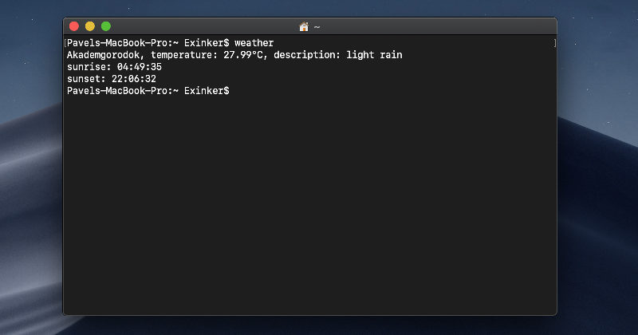

# Pavel Vashchenko

## Contacts
Phone: +7-906-907-26-69
Email: exinker@gmail.com
Address: Novosibirsk, Russia 630090

## About me
Hello! I'm python application developer at the scientific institute.

## Skills
- Python
- PyQt
- Machine Learning
- Linux
- Git


## Code Example
[Square Every Digit](https://www.codewars.com/kata/546e2562b03326a88e000020)

```
def square_digits(number):
    string = str(number)

    return int(
        ''.join(
            [str(int(s) ** 2) for s in string]
        )
    )
```
            
## Education
Novosibirsk State University, Department of Quantun Optics, 2006-2012
Languages: native Russian, A2 English

## Pet projects
1. PyQt5 Weather Application


2. Command line Weather Application
